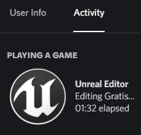

# Discord for Unreal Editor

Discord for Unreal Editor is a plugin that aims to bring features from Discord into the Unreal Engine Editor. Currently the project is very early, and only supports the Rich Presence feature, and the Win64 platform.

## Setup
1. Clone or otherwise download the repository into your project's plugins folder as `DiscordEditor`.
2. Download the [Discord Game SDK](https://discord.com/developers/docs/game-sdk/sdk-starter-guide).
3. Copy `discord_game_sdk.dll` and `discord_game_sdk.dll.lib` from the `lib/x86_64` folder, and put them in the `Binaries/Win64` folder of the plugin.
4. Copy all of the files from the `cpp` folder, and put them in the `Source/DiscordEditor/discord-files` folder in the plugin.
5. Start your project, and enable the `Discord for Unreal Editor` plugin.
6. Assuming you have the necessary tools to compile C++ for Unreal Engine, the engine should build a plugin, and you will be able to access and configure the plugin for your project under `Project Settings -> Plugins -> Discord for Unreal Editor`.
7. By default, Rich Presence is **disabled** to protect the privacy of your project, you will need to manually enable it, and then restart the Editor.